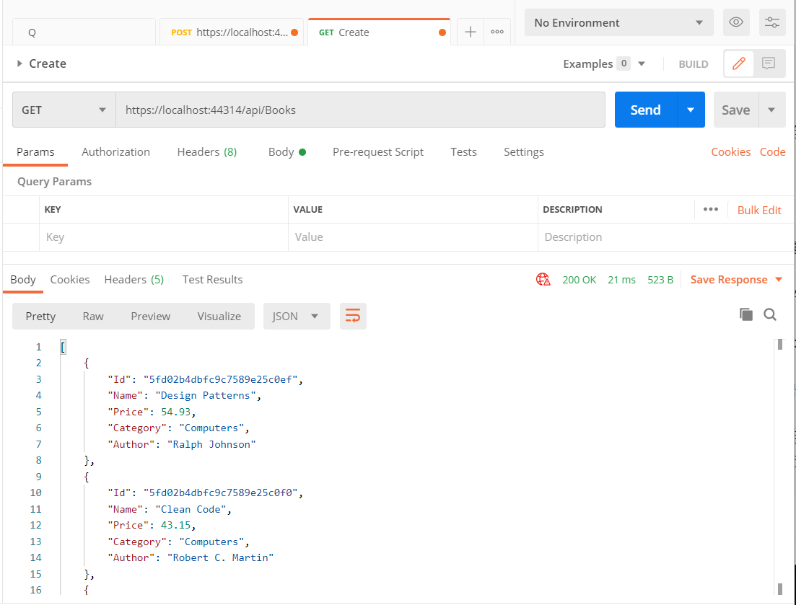
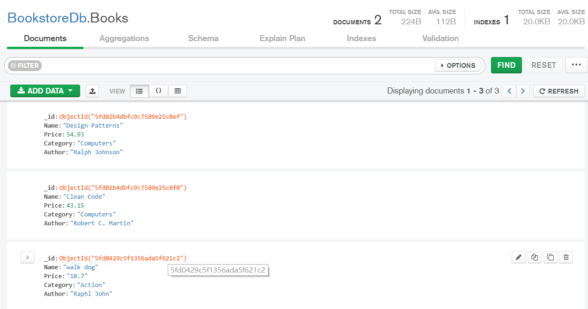

# Asp.net core Learning

Study for the .net core

### RazorPageMoive
1. 教程参考官网 [Razor](https://docs.microsoft.com/zh-cn/aspnet/core/tutorials/razor-pages/?view=aspnetcore-5.0) 。
2. 具体功能的实现是做了一个简单的Web前后端应用程序，通过URL对应的请求把数据存取到本地MySQL中。
3. 相对于官网教程有改动：删除了Pages/Shared/_Layout.cshtml文件关于Home组件的显示，并加上了Pages/Movies/Index的组件，通过组件可以直接进入到Movies的索引界面，不需要再手动输入改变URL跳转。

### MvcMovie
1. 教程参考官网 [Mvc](https://docs.microsoft.com/zh-cn/aspnet/core/tutorials/first-mvc-app/start-mvc?view=aspnetcore-5.0&tabs=visual-studio) 。

### TodoAPI
1. 编写了Web后端，Controller负责处理HTTP请求逻辑，TodoItemDTO负责页面显示。参考[Web API](https://docs.microsoft.com/zh-cn/aspnet/core/tutorials/first-web-api?view=aspnetcore-5.0&tabs=visual-studio)

2. 加入了使用JS的前端代码，前端样式有待改善。参考[使用JS的Web API](https://docs.microsoft.com/zh-cn/aspnet/core/tutorials/web-api-javascript?view=aspnetcore-5.0) 

### BooksAPI
1. 根据官网教程 [使用MongoDB的API](https://docs.microsoft.com/zh-cn/aspnet/core/tutorials/first-mongo-app?view=aspnetcore-5.0&tabs=visual-studio)创建API，首先讲一下如何配置MongoDB数据库：
    + 先去官网下载[MongoDB安装包](https://www.mongodb.com/try/download/community)以及[MongoDBCompass](https://www.mongodb.com/try/download/compass)（可选）可视化界面软件
    + 安装好MongoDB后配置环境变量，把 `.../MongoDB/bin`路径加入到系统变量的path路径里，打开cmd命令行窗口，输入`mongo`命令显示版本号即成功。
    + 安装好后的data文件夹用于存放数据，`.../MongoDB/log/mongod.log`文件用于存放日志文件
    + 配置数据存储位置以及日志记录位置：打开cmd命令行窗口，输入`mongod -dbpath E:\MongoDB\data -logpath E:\MongoDB\log\mongod.log -install -serviceName "MongoDB"`(备注：-指不删除之前的数据进行配置  --指删除之前的数据再配置)
    + cmd管理员身份运行：`net start mongodb`即启动服务
2. 使用[Postman](https://www.postman.com/downloads/) 可以测试API，启动服务后通过对应的GET、POST等请求来执行对MongoDB数据库的操作，利用MongoDBCompass可以查看对应数据库数据。

### 实时通信
*****
##### 使用JavaScript的SignalR
1. 参考官网基础教程使用[JavaScript的SignalR](https://docs.microsoft.com/zh-cn/aspnet/core/tutorials/signalr?view=aspnetcore-5.0&tabs=visual-studio)，实现自我通信。
##### 使用Blazor的SignalR
1. Blazor界面风格可扩展化，较好的UI界面，教程参考[使用Blazor的SignalR](https://docs.microsoft.com/zh-cn/aspnet/core/tutorials/signalr-blazor-webassembly?view=aspnetcore-5.0)。